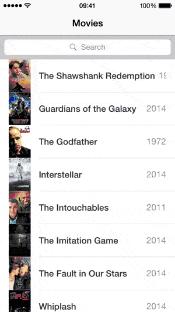

# iOS instant search demo

This is a sample project implementing an instant-search view with [Algolia](https://www.algolia.com/). Algolia is a Search API that provides hosted full-text, numerical and faceted search.

## Features

* Full Swift using the [AlgoliaSearch Swift API client](https://github.com/algolia/algoliasearch-client-swift)
* Displaying results as you type
* Match highlighting
* Infinite scroll

## Setup

* Clone the repository
* `pod install`
* Open the Xcode Workspace
* Build & Run!

## Tutorial

**Follow this [step by step tutorial](https://www.algolia.com/doc/tutorials/ios-instant-search) (on Algolia.com) to learn how this implementation works** and how it has been built using the [Algolia's Swift API Client](https://github.com/algolia/algoliasearch-client-swift).

## See it in action

